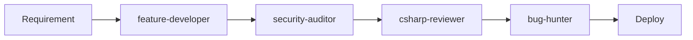
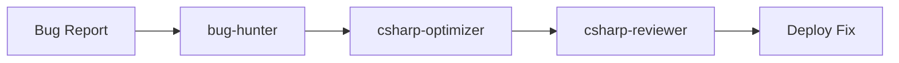
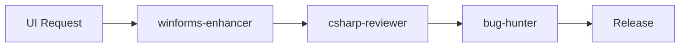

# SysBot.NET Agent Team Guide

A comprehensive guide to using the specialized Claude Code agent team for SysBot.NET development.

## 🚀 Quick Start

These agents are designed to work with Claude Code to help you develop, maintain, and enhance SysBot.NET - a Pokemon game automation tool. Each agent has specific expertise in different aspects of C# 13/.NET 9 development, WinForms applications, and Pokemon automation.

## Installation
These subagents are automatically available when placed in ~/.claude/agents/ directory.
```
cd ~/.claude
git clone https://github.com/hexbyt3/sys-agents.git
```
## 📋 Table of Contents

- [Agent Overview](#agent-overview)
- [Agent Profiles & Use Cases](#agent-profiles--use-cases)
- [Recommended Workflows](#recommended-workflows)
- [Best Practices](#best-practices)
- [Common Scenarios](#common-scenarios)
- [Tips & Tricks](#tips--tricks)

## 🤖 Agent Overview

| Agent | Primary Role | When to Use |
|-------|-------------|-------------|
| **csharp-reviewer** | Code quality guardian | After every code change |
| **csharp-optimizer** | Performance enhancer | When facing slowdowns |
| **winforms-enhancer** | UI/UX modernizer | For interface improvements |
| **pokemon-specialist** | Game mechanics expert | For Pokemon-specific features |
| **bug-hunter** | Issue detector & fixer | When bugs arise |
| **feature-developer** | New capability builder | For adding features |
| **refactoring-expert** | Code structure improver | For cleanup & modernization |
| **security-auditor** | Vulnerability protector | For security reviews |

## 👥 Agent Profiles & Use Cases

### 🔍 csharp-reviewer
**Expert C# code reviewer specializing in C# 13/.NET 9 with focus on WinForms and Pokemon automation.**

#### Real-World Use Cases:

**1. Post-Merge Review**
```bash
# After merging a PR
@csharp-reviewer review the recent changes for potential issues
```
The agent will check for thread safety violations, memory leaks, and ensure proper PKHeX API usage.

**2. Before Release**
```bash
@csharp-reviewer perform a comprehensive review of the TradeBotModule
```
Ensures production readiness by checking error handling, resource disposal, and configuration safety.

**3. New Developer Onboarding**
```bash
@csharp-reviewer review this contribution from our new developer
```
Helps maintain code standards and provides educational feedback.

### ⚡ csharp-optimizer
**Performance optimization expert for reducing latency and improving efficiency.**

#### Real-World Use Cases:

**1. Slow Pokemon Search**
```bash
@csharp-optimizer the Pokemon search in boxes is taking 5+ seconds
```
The agent will implement Span<T> optimizations, parallel processing, and caching strategies.

**2. Memory Usage Spike**
```bash
@csharp-optimizer memory usage grows to 2GB after running for 24 hours
```
Identifies object pooling opportunities and implements zero-allocation patterns.

**3. Trade Execution Speed**
```bash
@csharp-optimizer optimize the trade execution loop for faster processing
```
Reduces allocations, implements ValueTask, and optimizes async operations.

### 🎨 winforms-enhancer
**UI/UX specialist for creating modern, responsive interfaces.**

#### Real-World Use Cases:

**1. Dark Mode Implementation**
```bash
@winforms-enhancer add dark mode support to all forms
```
Creates a theme system with smooth transitions and saves user preferences.

**2. Real-Time Stats Dashboard**
```bash
@winforms-enhancer create a live statistics panel showing trades/hour
```
Implements double-buffered charts with smooth animations and efficient updates.

**3. High DPI Support**
```bash
@winforms-enhancer fix blurry text on 4K monitors
```
Implements per-monitor DPI awareness and scales all controls properly.

### 🎮 pokemon-specialist
**Pokemon automation expert with deep knowledge of game mechanics and PKHeX.**

#### Real-World Use Cases:

**1. New Game Support**
```bash
@pokemon-specialist add support for Pokemon Scarlet/Violet DLC
```
Implements new memory offsets, trade sequences, and Pokemon data structures.

**2. Shiny Hunt Optimization**
```bash
@pokemon-specialist optimize the encounter bot for shiny hunting
```
Implements RNG prediction, optimal reset timing, and statistical tracking.

**3. Trade Validation**
```bash
@pokemon-specialist add legality checking before trades
```
Integrates PKHeX validation, prevents illegal Pokemon distribution, and adds safety checks.

### 🐛 bug-hunter
**Bug detection specialist for finding and fixing elusive issues.**

#### Real-World Use Cases:

**1. Random Disconnections**
```bash
@bug-hunter the bot randomly disconnects after 2-3 hours
```
Identifies memory leaks, implements proper reconnection logic, and adds diagnostic logging.

**2. UI Freezing**
```bash
@bug-hunter the UI freezes when processing large trade queues
```
Finds cross-thread violations and implements proper async/await patterns.

**3. Data Corruption**
```bash
@bug-hunter sometimes Pokemon data gets corrupted during trades
```
Implements data validation, adds checksums, and creates backup mechanisms.

### ✨ feature-developer
**New feature implementation specialist using modern C# patterns.**

#### Real-World Use Cases:

**1. Discord Integration**
```bash
@feature-developer add Discord bot integration for trade queues
```
Implements webhook system, queue notifications, and user management.

**2. Web Dashboard**
```bash
@feature-developer create a web API for remote monitoring
```
Builds RESTful API with real-time WebSocket updates and authentication.

**3. Batch Operations**
```bash
@feature-developer add ability to process multiple Pokemon at once
```
Implements parallel processing, progress tracking, and cancellation support.

### 🔧 refactoring-expert
**Code modernization specialist for improving architecture and maintainability.**

#### Real-World Use Cases:

**1. Legacy Code Cleanup**
```bash
@refactoring-expert refactor the 2000-line BotManager class
```
Splits into smaller classes, implements SOLID principles, and adds dependency injection.

**2. C# 13 Migration**
```bash
@refactoring-expert modernize codebase to use C# 13 features
```
Implements primary constructors, collection expressions, and improved pattern matching.

**3. Test Coverage**
```bash
@refactoring-expert make the trade module more testable
```
Extracts interfaces, removes static dependencies, and adds unit test infrastructure.

### 🔒 security-auditor
**Security specialist for protecting against vulnerabilities and ensuring safe operation.**

#### Real-World Use Cases:

**1. API Security Review**
```bash
@security-auditor review the new web API endpoints
```
Implements authentication, rate limiting, and input validation.

**2. Trade Exploit Prevention**
```bash
@security-auditor prevent users from injecting malicious Pokemon data
```
Adds comprehensive validation, size limits, and data sanitization.

**3. Configuration Security**
```bash
@security-auditor secure sensitive configuration like API keys
```
Implements secret management, encryption, and environment separation.

## 🔄 Recommended Workflows

### 🏁 New Feature Workflow


1. **Start with feature-developer** to implement the new capability
2. **Run security-auditor** to ensure no vulnerabilities
3. **Use csharp-reviewer** for code quality check
4. **Deploy bug-hunter** for edge case testing

### 🐛 Bug Fix Workflow


1. **bug-hunter** identifies root cause
2. **csharp-optimizer** ensures fix doesn't impact performance
3. **csharp-reviewer** validates the solution

### 🎨 UI Enhancement Workflow


1. **winforms-enhancer** implements visual improvements
2. **csharp-reviewer** ensures thread safety
3. **bug-hunter** tests for UI glitches

## 📚 Best Practices

### 1. **Chain Agents for Complex Tasks**
```bash
# Example: Adding a new Pokemon automation feature
@pokemon-specialist design optimal shiny hunting strategy
@feature-developer implement the shiny hunter bot
@winforms-enhancer add UI controls for shiny hunting
@csharp-reviewer review the complete implementation
```

### 2. **Use Specific Context**
```bash
# Good
@bug-hunter the trade bot crashes when receiving Japanese Pokemon names

# Less effective
@bug-hunter fix the crash
```

### 3. **Leverage Agent Expertise**
```bash
# Use pokemon-specialist for game mechanics
@pokemon-specialist what's the best way to detect shiny Pokemon in memory?

# Use security-auditor for vulnerabilities
@security-auditor review this user input handling code
```

### 4. **Regular Maintenance Cycles**
```bash
# Weekly security review
@security-auditor scan for new vulnerabilities

# Monthly performance check
@csharp-optimizer analyze performance bottlenecks

# Before each release
@csharp-reviewer comprehensive review
@bug-hunter regression testing
```

## 🎯 Common Scenarios

### Scenario 1: Performance Degradation
```bash
# User reports: "Bot is slow after running for a few hours"
@bug-hunter investigate memory leaks or resource exhaustion
@csharp-optimizer profile and optimize the hot paths
@refactoring-expert restructure if architectural issues found
```

### Scenario 2: Adding Multi-Game Support
```bash
# Need to support a new Pokemon game
@pokemon-specialist analyze new game's memory structure
@feature-developer implement game-specific modules
@refactoring-expert create abstraction layer for multi-game support
@csharp-reviewer ensure code maintains quality standards
```

### Scenario 3: User Interface Overhaul
```bash
# Modernizing the dated UI
@winforms-enhancer design modern interface with dark mode
@security-auditor ensure no security regressions
@bug-hunter test all UI interactions thoroughly
@csharp-optimizer ensure UI remains responsive
```

### Scenario 4: Critical Security Patch
```bash
# Vulnerability discovered in trade validation
@security-auditor identify all affected code paths
@bug-hunter create proof-of-concept exploit for testing
@feature-developer implement secure validation
@csharp-reviewer verify security measures are comprehensive
```

## 💡 Tips & Tricks

### 1. **Agent Combinations**
Some agents work exceptionally well together:
- **bug-hunter + csharp-optimizer**: For fixing performance bugs
- **pokemon-specialist + feature-developer**: For game-specific features
- **refactoring-expert + security-auditor**: For secure architecture

### 2. **Context Preservation**
```bash
# Start a session with context
@csharp-reviewer we're working on the trade queue system today
# All subsequent reviews will consider this context
```

### 3. **Incremental Improvements**
```bash
# Don't try to fix everything at once
@refactoring-expert focus only on the TradeModule class for now
```

### 4. **Learning from Agents**
```bash
# Ask agents to explain their reasoning
@csharp-optimizer explain why Span<T> is better here
@security-auditor what makes this pattern vulnerable?
```

### 5. **Custom Workflows**
Create your own agent combinations for specific needs:
```bash
# For a new developer
@csharp-reviewer + @bug-hunter provide educational feedback

# For production hotfix
@bug-hunter + @security-auditor quick fix with minimal risk

# For feature planning
@pokemon-specialist + @feature-developer feasibility analysis
```

## 🚨 Important Notes

1. **Always run csharp-reviewer** after significant changes
2. **Security-auditor** should review anything touching user data
3. **Bug-hunter** is essential before releases
4. **Pokemon-specialist** must validate game-specific changes
5. **Test changes** in a safe environment first

## 📈 Measuring Success

Track these metrics to ensure agents are helping:
- **Reduced bug count** (bug-hunter effectiveness)
- **Performance improvements** (csharp-optimizer impact)
- **Security incidents** (security-auditor value)
- **Code quality scores** (csharp-reviewer + refactoring-expert)
- **Feature delivery speed** (feature-developer efficiency)
- **User satisfaction** (winforms-enhancer success)

## 🎉 Conclusion

This agent team provides comprehensive coverage for all aspects of SysBot.NET development. By using them strategically and in combination, you can maintain high code quality, implement features rapidly, and ensure a secure, performant automation tool.

Remember: The agents are tools to augment your development process. Use them proactively rather than reactively for best results!

---

*Happy coding with your SysBot.NET agent team! 🤖✨*
